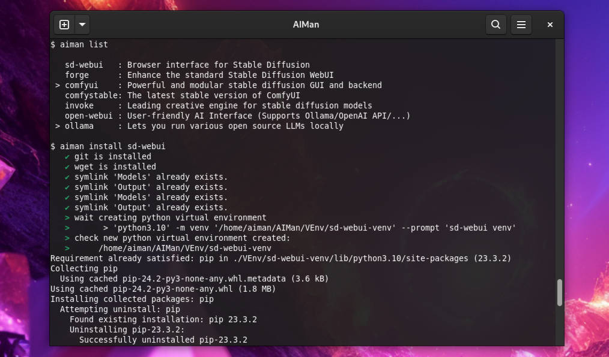

<div align="center">

# AIMan

<p>


</p>


</div>

**AIMan** is a lightweight package manager to handle open-source AI projects,
built entirely with Bash scripts and designed to run via the command line. It was
developed for personal use on my specific setup (Fedora), so compatibility with
other environments might be limited. However, the code is available on GitHub for
anyone who finds it useful.

Please note that AIMan was not conceived for public use and may contain
incomplete features or bugs, as well as potential information loss in
different contexts beyond my usage.


## AI projects supported

 - [x] Open WebUI
 - [x] Ollama
 - [ ] llama.cpp
 - [x] ComfyUI
 - [x] InvokeAI
 - [x] Stable Diffusion WebUI Forge


## Installation

To securely install AIMan, follow these straightforward steps. This process
involves creating a dedicated user account called `aiman` that will be used
to run the AIMan script. Having a separate user account enhances the security
of the installation by limiting the access and permissions on your system.

1. Create a new user for AIMan and set a password:
    ```
    sudo useradd -m aiman && sudo passwd aiman
    ```

2. Switch to the AIMan user:
    ```
    su - aiman
    ```

3. Clone the AIMan repository from GitHub:
    ```
    git clone https://github.com/martin-rizzo/AIMan.git
    cd AIMan
    ```

4. (optional) Add AIMan to the PATH and update the shell session:
    ```
    ./aiman add2path && source ~/.bashrc
    ```

5. (optional) Set the directory where the AI models are located:
    ```
    ./aiman setdir @models /path/to/your/models/directory
    ```

6. (optional) Set the output directory for AIMan:
    ```
    ./aiman setdir @output /path/to/your/output/directory
    ```

7. Install the web UI project (replace `webui` with the desired project name):
    ```
    ./aiman webui.install
    ```

8. Launch the web UI (replace `webui` with the desired project name):
    ```
    ./aiman webui.launch
    ```

Please note that these instructions assume a Linux system and may require
additional steps or modifications based on your specific environment.


## Launching any AI project

To launch any AI project after the initial installation, follow these steps:

1. Switch to the AIMan user:
    ```
    su - aiman
    ```

2. Launch the web UI (replace `webui` with the desired project name):
   ```
   aiman webui.launch
   ```


## Contributing

This project was developed solely for personal needs. While contributions, bug
reports, and pull requests are welcome, please note that AIMan has only been
tested on Fedora 40. It may not be compatible with other systems or suitable
for production environments.


## Lincense

Copyright (c) 2023-2024 Martin Rizzo  
This project is licensed under the MIT license.  
See the ["LICENSE"](LICENSE) file for details.
